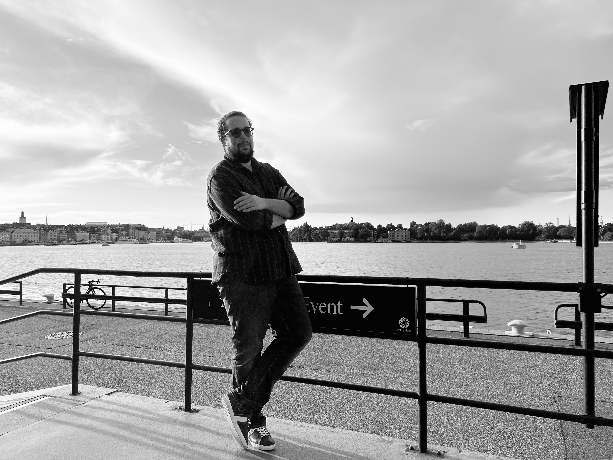

# 👋 Meet the Team!


Discover information about our team members, including their backgrounds and ongoing research. Take the opportunity to chat with them and learn more about what they're working on. Feel free to ask questions and start conversations — our team is friendly and happy to talk.


## Detours Vincent

👨‍🔬 PI — ✉️ vincent.detours@ulb.be  — be Brussels&#x20;

### Bio

### Current Research

## Tarabichi Maxime

👨‍🔬 PI — ✉️ maxime.tarabichi@ulb.be — be Brussels

### Bio

### Current Research

## Diego Serra

👨‍🔬 PhD — ✉️ diego.serra@ulb.be — be Brussels

<figure><figcaption>
 Lapland Kiruna (Sweden)
</figcaption></figure>

### Bio

Hello, I am Diego ! I started my PhD journey in September 2023. I achieved a master in Biomedical Sciences at the University of Mons in the Neurosciences and Physiology labs where I investigated the effects of different training conditions on neurogenesis and their relatioship with a myokine called the irisin.

Meanwhile, I contributed to the modeling of an in vitro hypothalamus at the Karolinska Institutet, working under the guidance of Professor Ceccatelli.

Next, I pursued a master in bioinformatics at the Université Libre de Bruxelles under the supervision of Pr. Detours, where I layed the groundwork to histological quantitative trait loci (histoQTL).

### Current Research

Currently, I am dedicated to my master thesis project related to the the histological quantitative trait loci. I am exploring the genomic relationships with histology, employing an in-lab developped AI pipeline.

My upcoming PhD project, titled "Single-cell Resolution 3D Molecular Histology of Papillary Thyroid Cancer and Adjacent Healthy Tissues," aims to construct a 3D model of papillary thyroid cancer (PTC) and healthy thyroid tissues. The project bridges the gap between 3D histology and molecular biology techniques, incorporating spatial transcriptomics, snRNA-seq, and spatially resolved genomics.

If you want to know more about my research, do not hesitate to come and talk to me !&#x20;

## Maxime Lefèbvre

👨‍🔬 PhD — ✉️ maxime.lefebvre@ulb.be — be Brussels

<figure><figcaption>
Old Man of Storr (Scotland - Isle of Skye)
</figcaption></figure>

### Bio

Hi, I am Maxime.  I'm a PhD student in IRIBHM computational biology lab. I have a background in biomedical sciences and bioinformatics.

I achieved a master in Biomedical Sciences at the University of Mons (UMONS) during which I contributed to two research projects. For my master's thesis, in the Laboratory of Metabolic and Molecular Biochemistry of UMONS, I studied of C1qBP functions in healthy and FSHD skeletal muscle cells with a specific focus on autophagy. During my Erasmus internship, in the Department of Paediatrics at Oxford University, I worked on the development of new delivery methods for microdystrophin gene therapy.

Then, I achieved a second master in Bioinformatics and Modelling at ULB. During this master I performed a company internship at GSK in the Research and Development department in order to characterize protein’s antigenic surface attribute. Finally, I performed my master's thesis under the supervision of Maxime T.  in the computational biology lab of IRIBHM where I studied the genome-wide differences in mutability between parental sets of chromosomes.

### Current Research

I started my PhD 1st October 2023 under the supervision of Maxime T. I'm currently working on two projects:

1. My master's thesis project: **Genome-wide differences in mutability between parental sets of chromosomes.** Basically, my goal is to find a new methodology to phase the whole genome of cancer patients in order to quantify somatic mutation and structural variants in each copy of the genome.
2. My PhD project: **Characterization of genetic variations in repeated regions of the genome with short-read sequencing.** Basically, my goal is to develop a suite of bioinformatics tools to call somatic and de-novo indels and substitutions from short read sequencing data including the non-unique genome (not well characterized), validate the tools apply it to a set of normal and cancer datasets. The final goal is to publish the tool as open source software for the general scientific community and will also make all the calls available for others to be able to mine the retrieved calls.

## Oier Azurmendi Senar

👨‍🔬 PhD — ✉️ oier.azurmendi@ulb.be — be Brussels

<figure><figcaption></figcaption></figure>

### Bio

Hello! My name is Oier and I am doing my PhD since October 2022. After studying the Bsc of  Biochemistry, I decided to start coding by studying the Msc in Computational Methods in Bioinformatics, both in the University of Navarra of Pamplona, Spain.

My Msc project was based on the transcriptomic characterization of different cholangiocarcinoma mouse models  and the analysis of different state of the art drug-target interaction methods based on graph methodology.

### Current Research

Actually, in my PhD project I am trying to decipher the intratumoral heterogeneity in resected PDAC. For that, I am trying to confirm that ] can co-exist in the same patient’s tumour and could impact therapeutic purpose. To finish, I al studying also the pathogenic mechanisms involved in the treatment resistance.

If you want to know more about my project, contact me whenever you want!

## Ruben Lattuca

👨‍🔬 PhD — ✉️ ruben.lattuca@ulb.be — be Brussels

### Bio

Hello, I am Ruben, a PhD student working in the computational lab of Vincent Detours. I completed a bachelor’s degree in Biomedical Sciences at the University of Mons and a master in Bioinformatics at the University of Bruxelles where I worked during my internship and my master thesis in Vincent Detours ‘lab.

### Current Research

I’m working on an RNA-editing enzyme, ADAR, converting adenosine to inosine in double stranded RNA substrates. While ADAR nucleoplasm and cytoplasmic functions are well-studied, little is known about its nucleolar enrichment. My goal is to understand the potential role of ADAR nucleolar location and reciprocally, the potential nucleolar role on ADAR functions.&#x20;

I’m mainly specialized in the processing and analyzes of RNA-sequencing data. During my thesis, we worked in collaboration with the laboratory of Denis Lafontaine, which gave me the opportunity to conduct wet lab experiments and acquire new knowledge.&#x20;

## Dalil Taher

👨‍🔬 PhD — ✉️ dalil.taher@ulb.be — be Brussels

<figure><figcaption>
Stockholm (Sweden)
</figcaption></figure>

### Bio

Hello world!

I am Dalil, a PhD student and member of the Computational Biology lab at the IRIBHM.

I completed my master’s in biomedical sciences at the Free University of Brussels. Despite being in a bioinformatic lab, my background primarily lies in the wetlab world. During my master's, I undertook several internships. Firstly, at the ULB Center for Diabetes Research, a laboratory of experimental medicine where I participated in investigating the non-canonical pathway of Nf-KB, specifically focusing on the role of the NIK protein in that pathway. Additionally, I interned at the Jules Bordet Institute, where I worked on deciphering the role of myeloid cells during human cancer development, with a significant emphasis on breast cancer.

### Current Research

In my current project, my main focus lies on genomic events occurring during human development. Through a robust collaboration with the Jules Bordet Institute, our current screening involves various aggressive human cancer biopsies. Our aim is to study the occurrence of copy-number events, particularly focusing on whole-genome doubling events.
